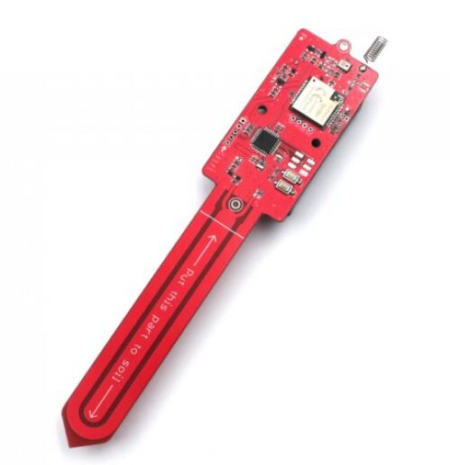
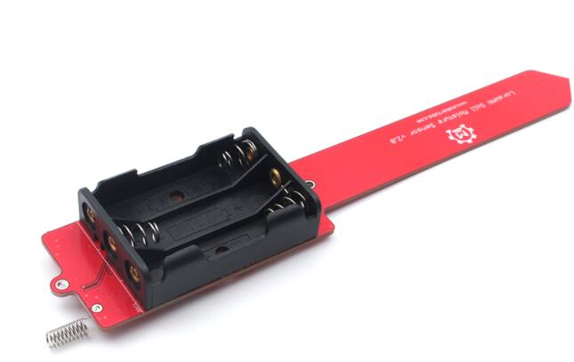
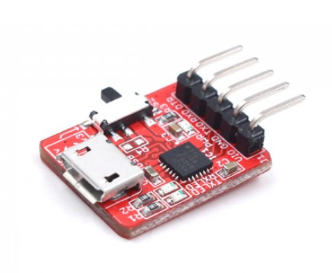
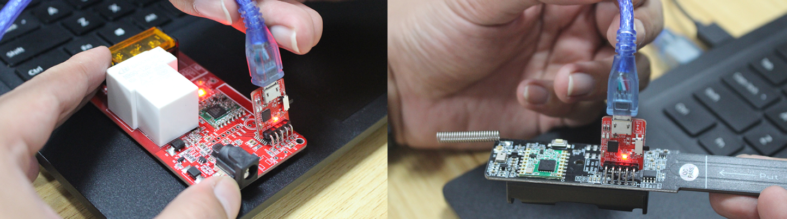
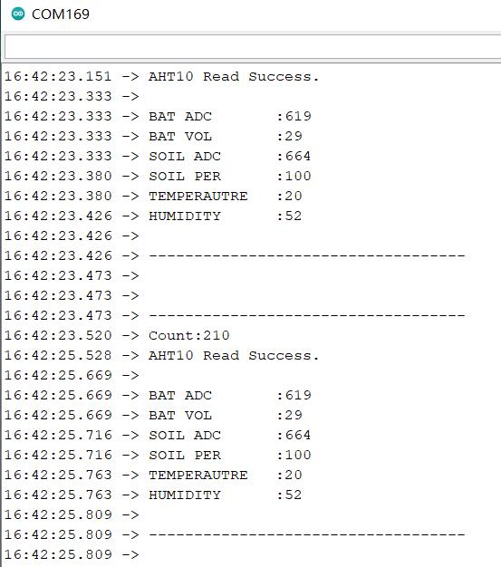
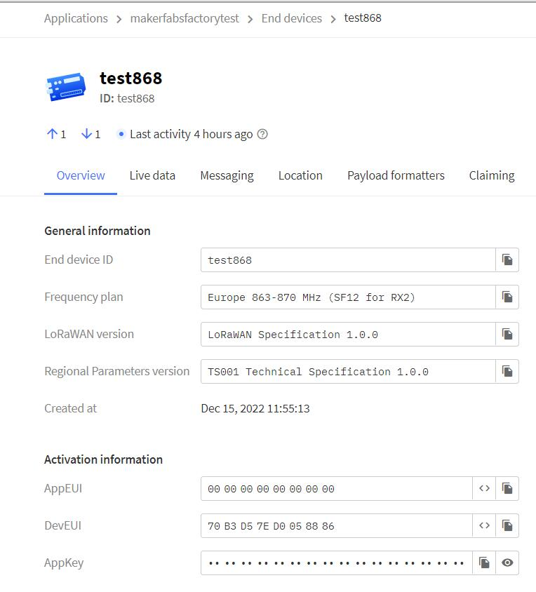

# LoraWAN Soil Moisture


```c++
/*
Version:		V1.1
Author:			Vincent
Create Date:	2022/12/15
Note:
	2022/12/16 V1.1	:Fix adc3 read error.
*/
```


[toc]

# Makerfabs

[Makerfabs home page](https://www.makerfabs.com/)

[Makerfabs Wiki](https://wiki.makerfabs.com/)


# LoraWAN Soil Moisture
## Intruduce

Product Link ：[LoRaWAN Temperature/ Humidity/ Soil Moisture Sensor](https://www.makerfabs.com/lorawan-temperatur-humidity-soil-moisture-sensor.html) 

Wiki Link : []() 


## Feature

- LoRaWAN Nodes, RA08H
- Soil Moisture Measurement based on capacitive Testing
- Low power: 7.1uA when sleeping/4mA in message sending turn around
- Onboard AHT10 sensor to monitor air temperature and air humidity
- Onboard Battery Voltage Measurement
- Full Open Source- all hardware and software open at GitHub
- Compatible with Arduino
- Supply power voltage: 4.7~3.5V


### Front:



### Back:



# Code

## Compiler Options

**If you have any questions，such as how to install the development board, how to download the code, how to install the library. Please refer to :[Makerfabs_FAQ](https://github.com/Makerfabs/Makerfabs_FAQ)**

- Open code with Arduino IDE
- Set Lorawan config in code.
- Upload codes, select "Arduino Pro or Pro Mini" and "3.3V 8MHz"

## Uploader

There is no USB socket or integrated serial port chip on some modules. But there are serial ports: VCC, GND, RX, TX, DTR. 

There are two ways to connect a serial port.


### MakerFabs CP2104 USB2UART

Product link : [CP2104 USB2UART](https://www.makerfabs.com/cp2104-usb-to-serial-converter.html)



This CP2104 USB to Serial Converter is super tiny, a highly-integrated USB-to-UART Bridge Controller providing a simple solution for updating and programming.

The serial port module has the same pin position as the makerfabs module with no USB port. So just plug it into the hole.



The usage of usb cable is the same after that.

### CP2102 MODULES USB TO TTL

There are many common USB serial port modules on the market, which are basically connected in a common way.

| Makerfabs | USB To TTL |
| --------- | ---------- |
| VCC       | 3.3V       |
| GND       | GND        |
| RX        | TXD        |
| TX        | RXD        |


## Testing file for manufacture

**moisture_test.ino**

This is a test demo. You can check all sensor, button, led and Lorawan.



Change Lorawan config to yourself.

```c++
//config.h

#define DEVEUI "YOUR_DEVEUI"
#define APPEUI "YOUR_APPEUI"
#define APPKEY "YOUR_APPKEY"


```



When hold on button, will send lorawan message to TTN.

```c++

```


## Firmware Frame

**mositure_lorawan**

This routine is expected to run on 3 AAA batteries for a year (once per hour).

Hibernation current 26ua, normal working current 4.7ma, peak emission 8.7ma.

The register is used to read the soil ADC and the battery voltage ADC. 

~~*There is a bug in the battery voltage ADC reading at present and it is being modified.*~~

 

Change Lorawan config to yourself.

Set sleep time, every watchdog sleep cycle nearly 8.5 s.

```c++
//Almost 1 hours
#define SLEEP_CYCLE 450
```


Lorawan sends data in the following ways:

```c++
    String temp = "AT+DTRX=1,2,8,";

    char data_str[80];
    sprintf(data_str, "%02x%02x%02x%02x", 
            (int)temperature, (int)humidity, soil_percent, bat_vol);
    temp = temp + data_str;
```


The corresponding parsing function for the thing network is as follows:

```javascript
function decodeUplink(input) {
  
  var temp = input.bytes[0]
  var humi = input.bytes[1]
  var adc = input.bytes[2]
  var bat = input.bytes[3]
  var num = input.bytes[4] * 100 + input.bytes[5] 
  
  return {
    data:{
    //adc,
    //temp,
    //humi,
    //bat,
    //num,
    field1:adc,
    field2:temp,
    field3:humi,
    field4:bat,
    field5:num,
    },
    
  };
  
```


## Example


### 328p_at

Example for AT command test.


# Case

3D print case is not ready.

